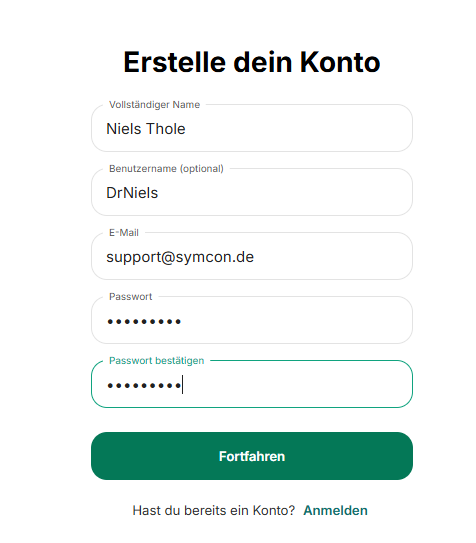
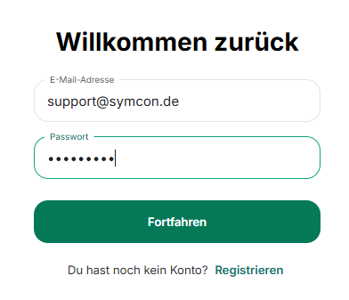
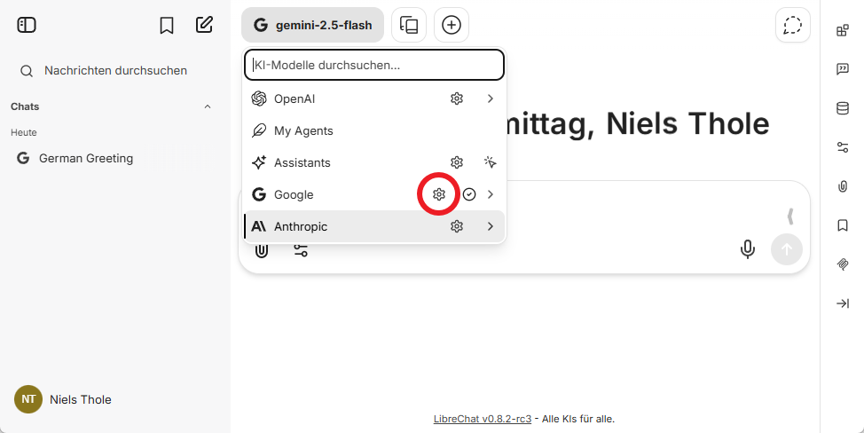
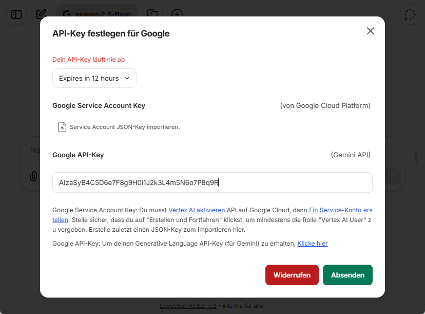
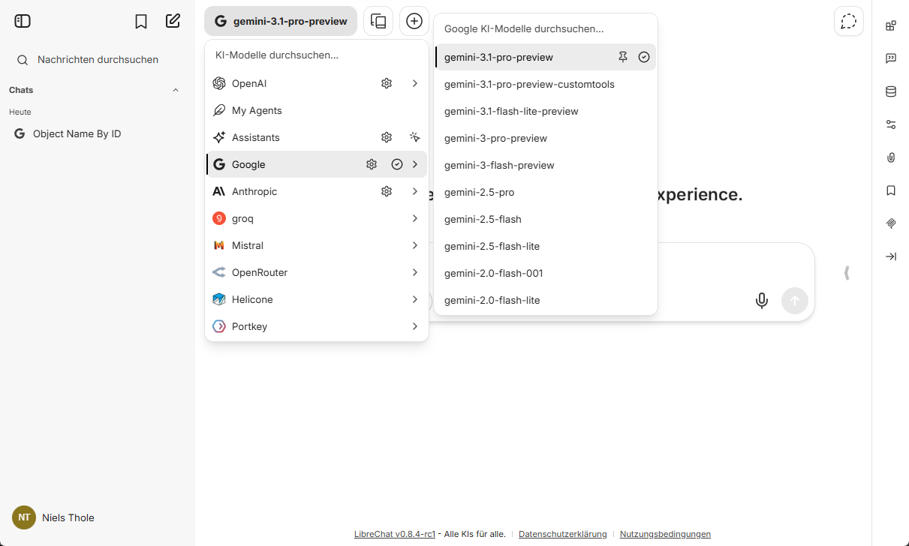
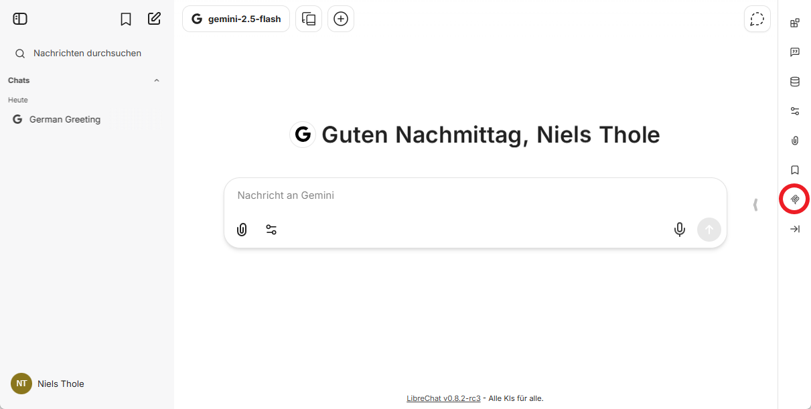
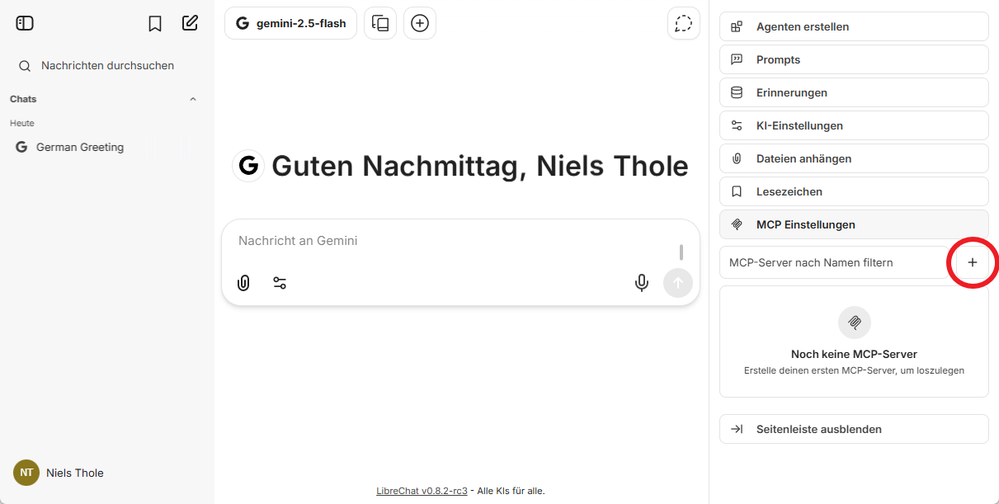
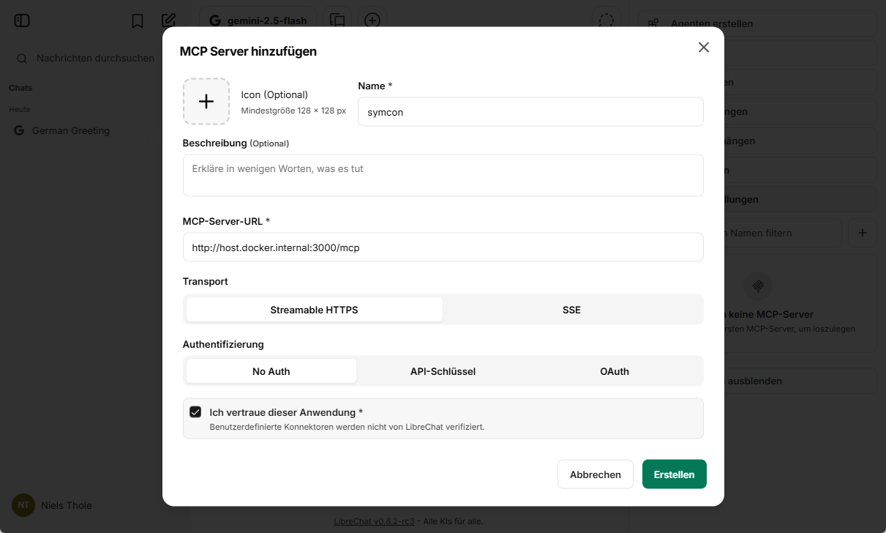
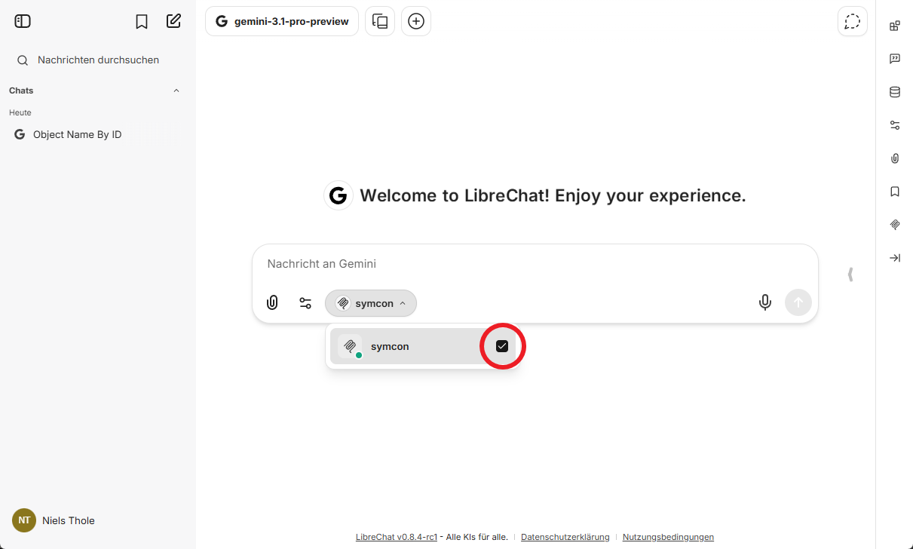

# MCP

[](https://www.symcon.de/service/dokumentation/entwicklerbereich/sdk-tools/sdk-php/)
[](https://www.symcon.de/produkt/)

Stellt Model Context Protocol (MCP) Funktionalität für Symcon bereit. Diese Bibliothek ermöglicht die Integration mit externen KI-Tools wie LibreChat, Claude und anderen MCP-kompatiblen Anwendungen und ermöglicht ihnen, über eine standardisierte Schnittstelle mit Symcon zu interagieren.

Folgende Module beinhaltet diese Bibliothek:

- MCP ([Dokumentation](MCP))

---

## Inhaltsverzeichnis

1. [Überblick](#überblick)
2. [Installation und Einrichtung](#installation-und-einrichtung)
3. [Verwendbare MCP-Funktionen](#verwendbare-mcp-funktionen)

---

## Überblick

Dieses Modul bietet eine Model Context Protocol (MCP) Brücke zwischen IP-Symcon und externen Anwendungen. Es besteht aus zwei Komponenten:

- **MCP-Modul**: Symcon Modul zur Bereitstellung von MCP Funktionen
- **TypeScript MCP-Server** (`lib/TS-Server/`): Standalone Node.js-Server, der als Brücke zwischen Symcon und externen MCP-Clients fungiert

Mit diesem Modul können externe Tools (wie ChatGPT-Plugins, LibreChat-Instanzen etc.) auf Symcon-Funktionen zugreifen, um:
- Variablen abzufragen und zu schalten
- Objekte zu suchen und zu verwalten
- Historische Daten abzurufen
- Das System zu überwachen

---

## Installation und Einrichtung

### 1. Kern-Instanz in Symcon erstellen

Siehe Moduldokumentation [MCP](MCP)

Das Modul registriert automatisch einen Webhook unter der Route `/hook/mcp` in Symcon.

#### 1.2 TypeScript MCP-Brücke starten

Die MCP-Brücke in `lib/TS-Server/` verbindet die MCP-Anfragen mit der Symcon-Instanz und leitet diese im korrekten MCP-Format weiter.

Dieser wird per Kommandozeile gestartet. Die Brücke muss nicht auf dem gleichen Rechner wie Symcon laufen. Soll die Brücke auf einem anderen Rechner laufen, dann muss dort ebenfalls der Inhalt des Modul, z.B. per Direktdownload via GitHub, vorhanden sein.

**Voraussetzungen:**
- [Node.js](https://nodejs.org/)

**Installation:**

Ausgehend vom Modulverzeichnis

```bash
cd lib/TS-Server
npm install
```

**Server starten:**

```bash
npm start --symcon-url=http://192.168.0.34:3777
```

**Hinweise zu den Parametern:**
- `--symcon-url`: Die URL, unter der Ihre Symcon-Instanz erreichbar ist (Standard: `http://127.0.0.1:3777`, also gleicher Rechner)
- `--port`: Der Port, auf dem der MCP-Server läuft (Standard: `3000`)

Der Server sollte folgende Meldung ausgeben:
```
Starting TS MCP Server
Symcon Hook URL: http://192.168.0.34:3777/hook/mcp/
MCP Server will start on port: 3000
```

### 2. Integration mit externem Tool am Beispiel von LibreChat

Andere Tools mit MCP Unterstützung sind ebenfalls möglich. Hier ist die Einrichtung für LibreChat vorgestellt. Andere Anwendungen werden vergleichbar eingerichtet.

#### LibreChat herunterladen

Falls git installiert ist, kann das Repository geklont werden:
```
git clone https://github.com/danny-avila/LibreChat
```

Alternativ kann unter https://github.com/danny-avila/LibreChat unter Code -> Download ZIP das Tool heruntergeladen und anschließend entpackt werden.

#### LibreChat starten

Der offiziellen Anleitung folgen, z.B. [hier](https://www.librechat.ai/docs/local/docker)

Zusätzlich die librechat.example.yaml kopieren und librechat.yaml nennen. In der Datei folgenden Abschnitt hinzufügen (oder die # davor entfernen):
```
mcpSettings:
  allowedDomains:
    - 'http://host.docker.internal:3000'
```

Und zum Abschluß die librechat.yaml aktivieren, indem die docker-compose.override.yml.example kopiert und in docker-compose.override.yml umbenannt wird. In dieser Datei folgenden Abschnitt hinzufügen (oder die # davor entfernen):
```
services:

# USE LIBRECHAT CONFIG FILE
  api:
    volumes:
    - type: bind
      source: ./librechat.yaml
      target: /app/librechat.yaml
```

Im Browser http://localhost:3080/ öffnen

#### Konto erstellen



Kontodaten eingeben und bestätigen. Die Daten bleiben nur bei der lokalen LibreChat Installation. Die E-Mail-Adresse muss nicht verifiziert werden.

#### Einloggen



Die im vorherigen Schritt gewählten Zugangsdaten eingeben und auf "Fortfahren" klicken.

#### Modell auswählen und konfigurieren



Oben die Modellauswahl öffnen und beim gewünschten Anbieter auf das Zahnrad klicken.



Im Dialog den API-Key des Anbieters eingeben und mit "Absenden" bestätigen.

Für verschiedene Anbieter kann diese Konfiguration abweichen. Sollte der gewünschte Anbieter nicht in der Liste vorhanden sein, kann die Konfiguration von LibreChat diesbezüglich erweitert werden.



Unter dem Anbieter das genaue Modell auswählen und per Klick bestätigen. Bei der Wahl des Modells ist wichtig, dass dies Tool Aufrufe unterstützt. Im Zweifelsfall erfüllen dies aber alle moderneren Modelle.

#### MCP einrichten



MCP Einstellungen per Klick auf das MCP Icon öffnen.



Auf das Plus für einen neuen MCP Server klicken.



Im Dialog die Daten des bereiten MCP-Servers eingeben:
- Name: beliebig, z.B. "symcon"
- MCP-Server-URL: http://host.docker.internal:3000/mcp (eventuell anderer Port, falls dies so konfiguriert wurde)
- Transport: Streamable HTTPS
- Authentifizierung: No Auth
- Ich vertraue dieser Anwendung: Bestätigen

Danach auf "Erstellen" klicken

#### MCP aktivieren



Unter "MCP Server" bei der Chateingabe den Haken bei symcon aktivieren.

#### Loslegen

Der Symcon MCP Server ist nun einsatzbereit und kann verwendet werden.

---

## Verwendbare MCP-Funktionen

Das Modul stellt folgende MCP Funktionen zur Verfügung:

### Steuerungsfunktionen

#### `switch-boolean` - Variable schalten
Schaltet eine boolesche Symcon-Variable auf einen bestimmten Wert (true/false).

**Parameter**
- `variableID` (Integer): Die ID der Variable in Symcon
- `value` (Boolean): Der neue Wert (true oder false)

**Rückgabe**
- `success` (Boolean): Bestätigung ob erfolgreich

---

### Abfragefunktionen

#### `get-value` - Wert einer Variable auslesen
Holt den aktuellen Wert einer Symcon-Variable. Gibt standardmäßig den formatierten Wert zurück, ermöglicht aber auch die Abfrage von Rohdaten

**Parameter**
- `objectID` (Integer): Die ID der Variable
- `raw` (Boolean, optional): true für Rohdaten statt formatierter Werte

**Rückgabe**
- `value`: Der aktuelle Wert der Variable

---

#### `get-name` - Namen auslesen
Gibt den Namen eines Symcon-Objekts zurück.

**Parameter**
- `objectID` (Integer): Die ID des Objekts

**Rückgabe**
- `name` (String): Der Name des Objekts

---

#### `get-object` - Detaillierte Objektinformationen
Holt vollständige Informationen zu einem Symcon-Objekt (entspricht [IPS_GetObject](https://www.symcon.de/de/service/dokumentation/befehlsreferenz/objektverwaltung/ips-getobject/)).

**Parameter**
- `objectID` (Integer): Die ID des Objekts

**Rückgabe**
- `info` (Objekt): Infos analog zur Rückgabe von IPS_GetObject

---

#### `get-children` - Unterobjekte auslesen
Listet alle IDs untergeordneter Objekte eines Objekts auf.

**Parameter**
- `objectID` (Integer): Die ID des Objekts

**Rückgabe**
- `children` (Liste): Liste der IDs aller untergeordneter Objekte

---

### Suchfunktionen

#### `find-objects` - Flexible Objektsuche
Sucht Objekte nach verschiedenen Kriterien. Unterstützt mehrere optionale Filter, die kombiniert werden können:

**Filteroptionen:**
- **name**: Suchtext im Objektnamen (Teilmatch, case-insensitive)
  - *Beispiel:* `"Temperatur"` findet "Wohnzimmer Temperatur", "Außentemperatur"
  
- **types**: Array von Objekttypen, es werden nur Objekte mit einem passenden Objekttyp zurückgegeben

- **usage**: Filter nach Funktion, mögliche Werte:
  - `"temperature"` = nur Temperaturvariablen

- **lastUpdate**: Filter nach letzter Änderung
  - `from`: Unix-Timestamp (in Sekunden)
  - `to`: Unix-Timestamp (in Sekunden)

---

#### `get-snapshot` - Kompletter System-Snapshot
Holt einen Snapshot des gesamten Symcon-Systems mit Daten zu allen Objekten.

**Warnung:** Diese Funktion gibt sehr große Datenmengen zurück und sollte sparsam verwendet werden. Bisher konnte darüber hinaus kein Modell den Snapshot sinnvoll nutzen.

**Rückgabe**
- `snapshot` (Objekt): Der gesamte Snapshot des Systems

---

### Zeit- und Historyfunktionen

#### `current-time` - Aktuelle Uhrzeit
Gibt die aktuelle Systemzeit in Unix-Timestamp und lesbarem Format zurück.

**Rückgabe**
- `timestamp` (Integer): Unix-Timestamp in Sekunden
- `formatted` (String): ISO 8601 Format (z.B. "2025-03-19T14:30:45Z")

---

#### `get-logged-data` - Historische Daten
Holt die Änderungshistorie einer Variable in einem Zeitbereich.

**Parameter**
- `variableID` (Integer): Die Variable
- `from` (Integer, optional): Start-Timestamp (Unix-Sekunden)
- `to` (Integer, optional): End-Timestamp (Unix-Sekunden)

**Rückgabe**
- Array mit Einträgen:
  - `TimeStamp`: Unix-Timestamp
  - `Value`: Der gespeicherte Wert
  - `Duration`: Wie lange dieser Wert gültig war (in Sekunden)
  - `FormattedTime`: ISO 8601 Format für Lesbarkeit

---

#### `get-status-log` - Systemprotokolle
Holt Meldungen aus dem Symcon-Statusprotokoll.

**Parameter**
- `types` (Liste, optional): Eine Liste von Meldungstypen, die abgefragt werden sollen:
    - `0` = Standard-Meldungen
    - `1` = Erfolgs-Meldungen
    - `2` = Mitteilungen
    - `3` = Warnungen
    - `4` = Fehler
    - `5` = Debug-Meldungen
    - `6` = Benutzerdefinierte Meldungen

**Rückgabe**
- `data` (Liste) Meldungen als Objekt codiert:
  - `TimeStamp`: Zeitpunkt
  - `Sender`: Komponente, die die Meldung verursacht hat
  - `Message`: Die Meldung
  - `Type`: Der Meldungstyp

---

### Verwaltungsfunktionen

#### `rename-object` - Objekt umbenennen
Ändert den Namen eines Symcon-Objekts.

**Parameter**
- `objectID` (Integer): Die ID des Objekts
- `newName` (String): Der neue Name

**Rückgabe**
- `success` (Boolean): Erfolgsmeldung
